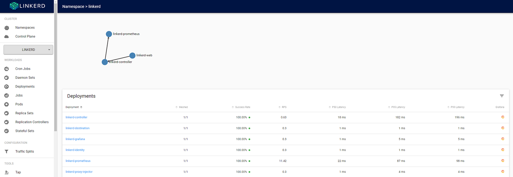

# CNCF project 🐳🚀

> This is a project to provide a Kubernetes infrastucture using Terraform and Ansible, also a Harbor registry for Docker images.
> It will be used CNCF (Cloud Native Computing Foundation) projects the whole implementation of this project.

## Instruction

```bash
# Harbor admin password
export HARBOR_ADMIN=SOME_PASSWORD
# terraform to deploy the required machines on cloud
pushd terraform && bash deploy.sh && popd
# ansible to install and configure K8S cluster on the machines
ansible-playbook registry-playbook.yml
ansible-playbook kubernetes-playbook.yml
```

## Linkerd

> Linkerd Dashboard



## Docs

> harbor

[https://goharbor.io/docs/2.0.0/install-config/download-installer/](https://goharbor.io/docs/2.0.0/install-config/download-installer/)

[https://goharbor.io/docs/2.0.0/install-config/configure-https/](https://goharbor.io/docs/2.0.0/install-config/configure-https/)

[https://goharbor.io/docs/2.0.0/install-config/configure-yml-file/](https://goharbor.io/docs/2.0.0/install-config/configure-yml-file/)

[https://goharbor.io/docs/2.0.0/install-config/quick-install-script/](https://goharbor.io/docs/2.0.0/install-config/quick-install-script/)

> ansible

[https://docs.ansible.com/ansible/latest/reference_appendices/config.html#ansible-configuration-settings](https://docs.ansible.com/ansible/latest/reference_appendices/config.html#ansible-configuration-settings)

[https://docs.ansible.com/ansible/latest/plugins/lookup/env.html](https://docs.ansible.com/ansible/latest/plugins/lookup/env.html)

[https://raw.githubusercontent.com/ansible/ansible/devel/examples/ansible.cfg](https://raw.githubusercontent.com/ansible/ansible/devel/examples/ansible.cfg)

> contour

[https://projectcontour.io/getting-started/](https://projectcontour.io/getting-started/)

> linkerd

[https://linkerd.io/2/getting-started/](https://linkerd.io/2/getting-started/)

## Authors

[Julio Cesar](https://github.com/julio-cesar-development)

## License

This project is licensed under the MIT License - see the [LICENSE.md](LICENSE.md) file for details
